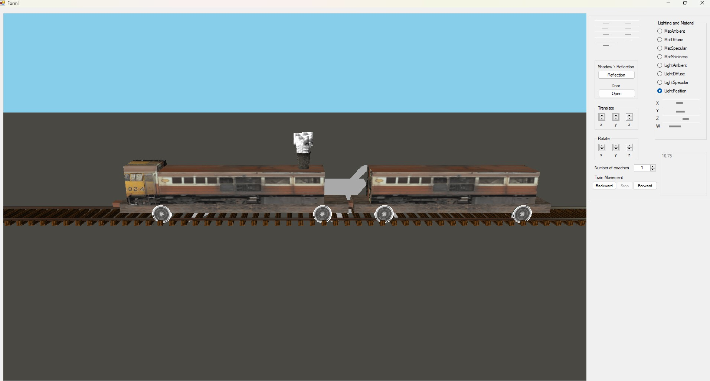

# Train Simulation Project

## Overview
This project simulates a 3D train locomotive with multiple coaches, implementing advanced 3D transformation, modeling, animation, texturing, shading, and lighting techniques. The application is developed in C# using OpenGL and is part of the computer graphics course curriculum for the third year BSc at Holon Institute of Technology (HIT).

## Features
- **Dynamic Interaction**: Control the train and view settings using mouse, keyboard, and standard UI elements such as scrollbars, radio buttons, and check boxes.
- **Dynamic Properties Modification**:
  - **Light properties**: Adjust light sources affecting shadows and reflections.
  - **Object transformations**: Change the position and form of the train and its environment.
  - **Texture and Shading**: Modify different shading techniques dynamically. Textures are applied to the elements.
- **Projection Controls**: Switch between orthogonal and perspective projections and adjust their parameters.
- **View Customization**: Change the point of view parameters to achieve different visual perspectives.

## Optional Features
- **External Definitions**: The project supports optional loading of objects, environmental settings, and properties from external files, detailing geometry, lighting, and texture information.

## Setup and Running Instructions
1. **Prerequisites**: Ensure you have Visual Studio installed with support for C#.
2. **Compilation**: Open the solution in Visual Studio, build the project to ensure all dependencies are correctly configured.
3. **Execution**: Run the application from Visual Studio or from the built executable to interact with the 3D train environment.

## Examples of Use
- **Train Movement**: Control a train locomotive with several coaches moving along tracks, capable of moving forwards or backwards.
- **Interaction**: Open and close doors of the train, adjust lighting conditions, and modify textures during runtime to demonstrate dynamic environment interaction.

## Documentation
Detailed comments in the code explain the functionalities of different methods and classes, providing insights into the use of OpenGL in a C# environment.

## Contributing
As this project is part of an academic course, contributions in the form of suggestions or improvements are welcome. Please fork the repository and submit pull requests as needed.

## License
This project is distributed under a proprietary license. Use of this software for commercial purposes without prior permission from the author is strictly prohibited.

